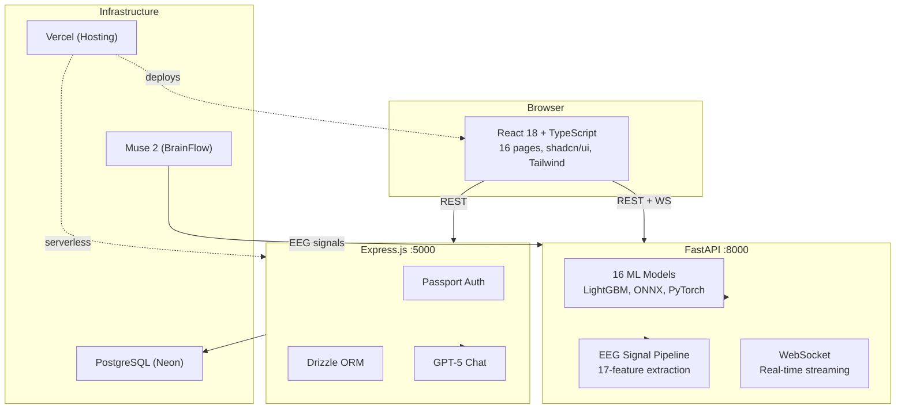
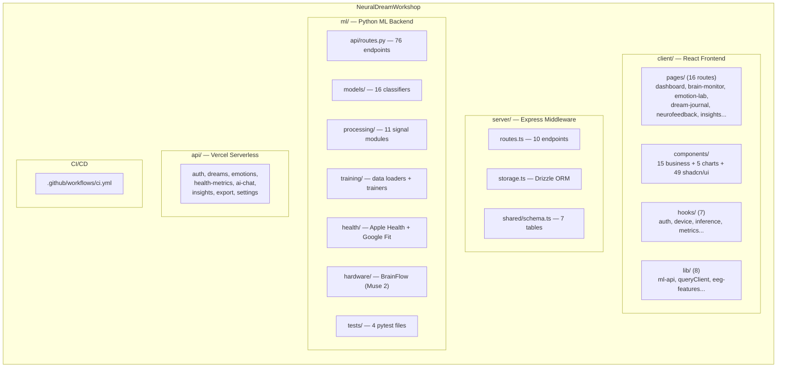
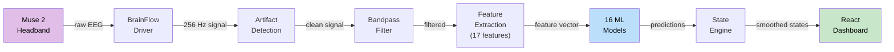
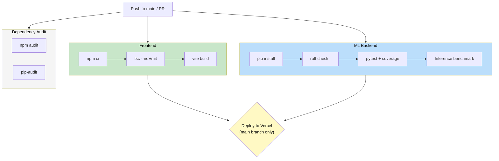
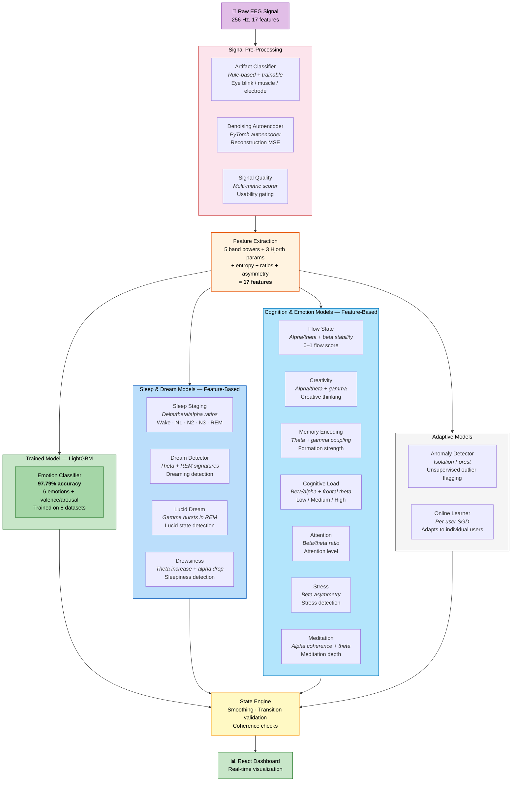

# Neural Dream Workshop

A brain-computer interface (BCI) web application that reads EEG signals from a Muse 2 headband and uses 16 machine-learning models to classify emotions, detect dreams, stage sleep, measure focus, and more — all visualized in a real-time React dashboard.

---

## Architecture



---

## Project Structure



---

## Detailed File Tree

```
NeuralDreamWorkshop/
│
├── .github/workflows/
│   └── ci.yml                              CI pipeline (lint, test, build, deploy)
│
├── client/src/                             REACT FRONTEND
│   ├── pages/                              16 route pages
│   │   ├── dashboard.tsx                     Main dashboard
│   │   ├── brain-monitor.tsx                 Real-time EEG visualization
│   │   ├── emotion-lab.tsx                   Emotion analysis lab
│   │   ├── dream-journal.tsx                 Dream recording & analysis
│   │   ├── dream-patterns.tsx                Dream pattern recognition
│   │   ├── neurofeedback.tsx                 Neurofeedback training
│   │   ├── brain-connectivity.tsx            Brain region connectivity
│   │   ├── health-analytics.tsx              Health metrics dashboard
│   │   ├── inner-energy.tsx                  Chakra & spiritual analysis
│   │   ├── session-history.tsx               Past session browser
│   │   ├── insights.tsx                      Weekly insights & trends
│   │   ├── ai-companion.tsx                  AI chat companion
│   │   ├── settings.tsx                      App settings
│   │   ├── auth.tsx                          Login / register
│   │   ├── landing.tsx                       Landing page
│   │   └── not-found.tsx                     404 page
│   ├── components/
│   │   ├── charts/                           5 charts (EEG, sleep, mood, spectrogram, connectivity)
│   │   ├── ui/                               49 shadcn/ui primitives
│   │   ├── brain-bands.tsx                   Frequency band visualizer
│   │   ├── calibration-wizard.tsx            User calibration flow
│   │   ├── device-connection.tsx             Muse 2 pairing UI
│   │   ├── emotion-wheel.tsx                 Valence-arousal wheel
│   │   ├── neural-network.tsx                Network visualization
│   │   ├── session-controls.tsx              Start/stop session
│   │   ├── signal-quality-badge.tsx          Signal quality indicator
│   │   └── sidebar.tsx                       App navigation
│   ├── hooks/                              7 custom hooks
│   │   ├── use-auth.tsx                      Auth state
│   │   ├── use-device.tsx                    BCI device connection
│   │   ├── use-inference.ts                  ML model inference
│   │   ├── use-metrics.tsx                   Health metrics
│   │   └── use-theme.tsx                     Dark/light theme
│   ├── lib/                                8 utility modules
│   │   ├── ml-api.ts                         FastAPI ML client
│   │   ├── ml-local.ts                       Client-side ONNX inference
│   │   ├── eeg-features.ts                   JS feature extraction
│   │   ├── queryClient.ts                    TanStack Query config
│   │   └── offline-store.ts                  Offline data persistence
│   ├── App.tsx                             Router (wouter) + all routes
│   └── main.tsx                            Entry point
│
├── server/                                 EXPRESS MIDDLEWARE
│   ├── index.ts                              Entry point (:5000)
│   ├── routes.ts                             10 REST endpoints
│   ├── storage.ts                            Drizzle ORM data layer
│   └── vite.ts                               Vite dev server integration
│
├── shared/
│   └── schema.ts                             7 Drizzle tables + Zod validators
│
├── api/                                    VERCEL SERVERLESS FUNCTIONS
│   ├── _lib/                                 Shared helpers (auth, db, openai)
│   ├── auth/                                 login, logout, me, register
│   ├── ai-chat/                              AI conversation endpoints
│   ├── dream-analysis/                       Dream analysis CRUD
│   ├── dreams/                               list, create, analytics, generate-image
│   ├── emotions/                             Emotion history + record
│   ├── health-metrics/                       Health data CRUD
│   ├── insights/                             Weekly insights
│   ├── export/                               Data export
│   ├── notifications/                        Push subscription
│   └── settings/                             User settings
│
├── ml/                                     PYTHON ML BACKEND
│   ├── main.py                               FastAPI entry point (:8000)
│   ├── api/
│   │   ├── routes.py                         76 REST endpoints (2K lines)
│   │   └── websocket.py                      Real-time EEG streaming
│   ├── models/                             16 ML model classes
│   │   ├── emotion_classifier.py             6 emotions, LightGBM, 97.79%
│   │   ├── sleep_staging.py                  Wake / N1 / N2 / N3 / REM
│   │   ├── dream_detector.py                 Dream state detection
│   │   ├── flow_state_detector.py            Flow scoring (0–1)
│   │   ├── creativity_detector.py            Creative thinking + memory encoding
│   │   ├── drowsiness_detector.py            Sleepiness detection
│   │   ├── cognitive_load_estimator.py       Mental workload
│   │   ├── attention_classifier.py           Attention level
│   │   ├── stress_detector.py                Stress detection
│   │   ├── lucid_dream_detector.py           Lucid dreaming
│   │   ├── meditation_classifier.py          Meditation depth
│   │   ├── anomaly_detector.py               Unusual EEG (Isolation Forest)
│   │   ├── artifact_classifier.py            Artifact classification
│   │   ├── denoising_autoencoder.py          Signal cleaning (PyTorch)
│   │   ├── online_learner.py                 Per-user adaptation
│   │   └── saved/                            Weights (.onnx, .pkl, .pt)
│   ├── processing/                         11 signal processing modules
│   │   ├── eeg_processor.py                  Feature extraction (17 features)
│   │   ├── artifact_detector.py              Artifact detection & removal
│   │   ├── signal_quality.py                 Signal quality scoring
│   │   ├── calibration.py                    Per-user baseline calibration
│   │   ├── confidence_calibration.py         Model confidence calibration
│   │   ├── state_transitions.py              Brain state engine
│   │   ├── connectivity.py                   Brain region connectivity
│   │   ├── emotion_shift_detector.py         Pre-conscious emotion detection
│   │   ├── noise_augmentation.py             Training data augmentation
│   │   ├── spiritual_energy.py               Chakra / aura / consciousness
│   │   └── user_feedback.py                  Personalized model tuning
│   ├── simulation/
│   │   └── eeg_simulator.py                  Synthetic EEG generation
│   ├── training/                           Model training
│   │   ├── mega_trainer.py                   Multi-algorithm trainer
│   │   ├── data_loaders.py                   8 EEG dataset loaders
│   │   ├── train_emotion.py                  Emotion classifier
│   │   ├── train_sleep.py                    Sleep staging
│   │   ├── train_dream.py                    Dream detector
│   │   └── benchmark.py                      Model benchmarking
│   ├── health/                             Wearable integrations
│   │   ├── apple_health.py                   Apple Health import/export
│   │   ├── google_fit.py                     Google Fit import
│   │   └── correlation_engine.py             Brain-body correlations
│   ├── hardware/
│   │   └── brainflow_manager.py              Muse 2 device manager
│   ├── storage/
│   │   ├── session_recorder.py               Session persistence
│   │   └── session_analytics.py              Trends & comparisons
│   ├── neurofeedback/
│   │   └── protocol_engine.py                Neurofeedback protocols
│   ├── tools/                              CLI utilities
│   │   ├── demo_full_pipeline.py             E2E pipeline demo
│   │   ├── import_apple_health.py            Apple Health XML importer
│   │   └── live_brain_session.py             Live session runner
│   ├── tests/                              pytest test suite
│   │   ├── conftest.py                       Shared fixtures
│   │   ├── test_models.py                    6 core model tests
│   │   ├── test_processing.py                Signal pipeline tests
│   │   ├── test_api.py                       FastAPI endpoint tests
│   │   └── test_accuracy_pipeline.py         Accuracy module tests
│   ├── benchmarks/                           Training results (JSON)
│   └── data/                                 EEG datasets (gitignored)
│
├── docs/
│   └── architecture.html                     Interactive architecture diagram
│
├── vercel.json                             Vercel config
├── package.json                            Node dependencies
├── tsconfig.json                           TypeScript config
├── vite.config.ts                          Vite bundler config
├── tailwind.config.ts                      Tailwind CSS config
├── drizzle.config.ts                       Drizzle ORM config
└── components.json                         shadcn/ui config
```

---

## Data Flow



---

## CI/CD Pipeline



---

## Quick Start

```bash
# Frontend + Express middleware (port 5000)
npm install
npm run dev

# ML backend (port 8000)
cd ml
pip install -r requirements.txt
uvicorn main:app --reload --port 8000
```

## Environment Variables

| Variable | Used By | Purpose |
|----------|---------|---------|
| `DATABASE_URL` | Express | Neon PostgreSQL connection string |
| `OPENAI_API_KEY` | Express | GPT-5 for dream analysis + AI chat |
| `SESSION_SECRET` | Express | Express session encryption |
| `JWT_SECRET` | Vercel API | JWT token signing (serverless) |

## The 16 ML Models



> **Why only 1 model has accuracy?** The Emotion Classifier is the only model trained on labeled datasets (SEED, GAMEEMO, Brainwave, etc.). The other 15 models use peer-reviewed EEG neuroscience heuristics — band power ratios, spectral entropy, Hjorth parameters — because no large labeled datasets exist for subjective states like "flow" or "creativity". They work without trained weights by applying established biomarker rules.

## Testing

```bash
# ML tests with coverage
cd ml && pytest tests/ -v --cov=. --cov-report=term-missing

# TypeScript type checking
npx tsc --noEmit

# Full frontend build
npm run build
```

## Deployment

- **Frontend + Express** — Vercel (see `VERCEL_DEPLOYMENT.md`)
- **ML Backend** — Docker or standalone (`uvicorn main:app`)
- **Database** — Neon PostgreSQL (`drizzle-kit push` for migrations)

## Tech Stack

| Layer | Technology |
|-------|-----------|
| Frontend | React 18, TypeScript, Tailwind CSS, shadcn/ui, wouter, TanStack Query, Recharts |
| Middleware | Express.js, Passport, Drizzle ORM, JWT |
| ML Backend | FastAPI, scikit-learn, LightGBM, PyTorch, ONNX Runtime, BrainFlow |
| Database | PostgreSQL (Neon serverless) |
| Hosting | Vercel (frontend + API), self-hosted (ML backend) |
| CI/CD | GitHub Actions |

## License

MIT
