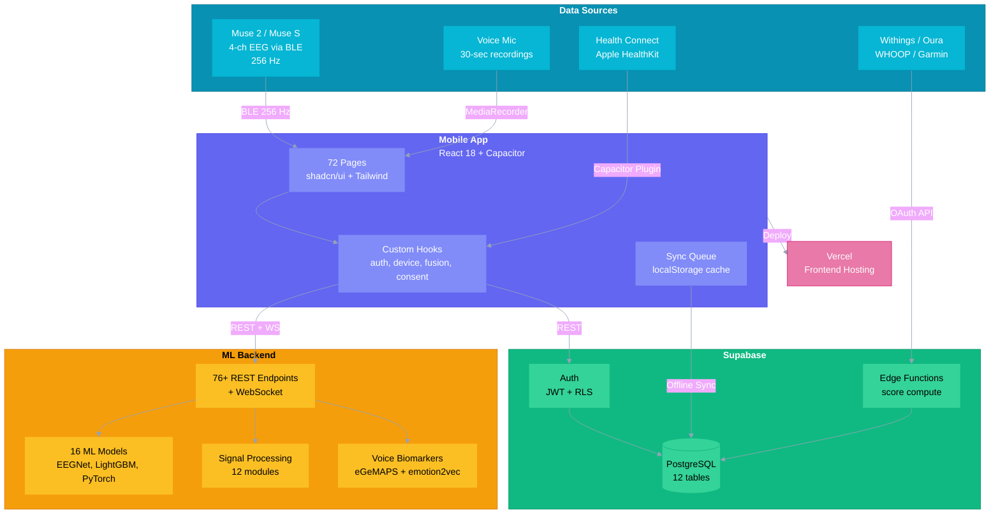
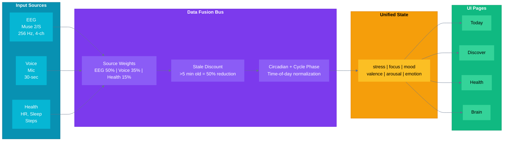
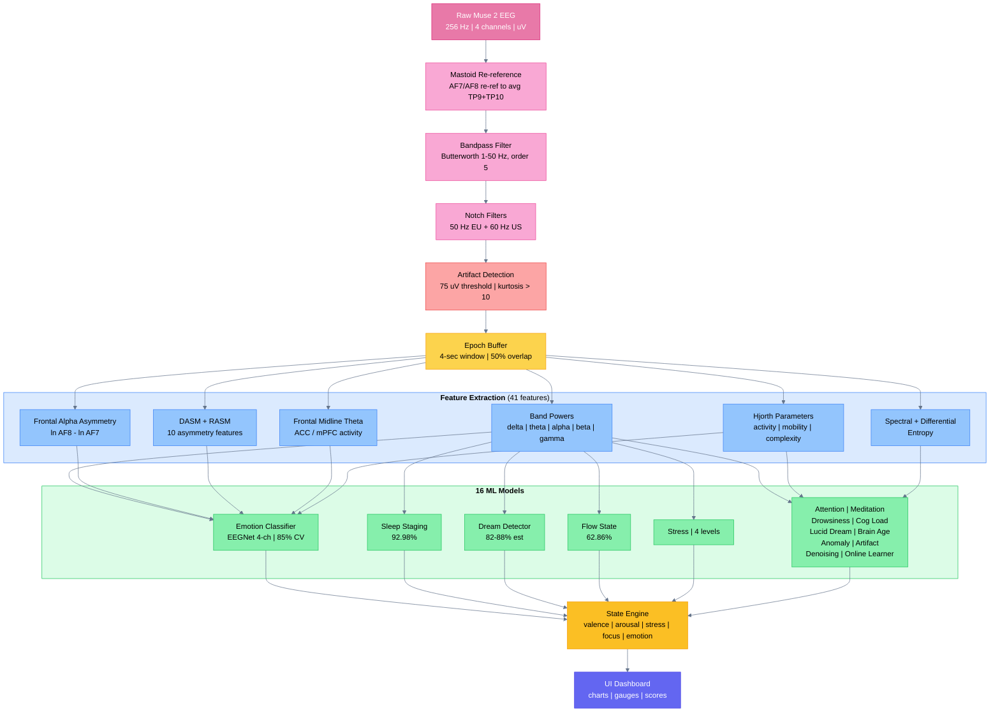

# AntarAI

A multimodal AI health platform that fuses EEG brain data, voice analysis, and health device sync (Withings, Oura, WHOOP, Garmin) to track emotions, stress, focus, sleep, nutrition, and wellness -- with 16 ML models running on-device and in the cloud.

**72 pages | 16 ML models | 3 data sources | Supabase backend | Capacitor mobile app**

---

## System Architecture



---

## Data Fusion Architecture



---

## EEG Signal Processing Pipeline



---

## Database Schema (Supabase)

```mermaid
erDiagram
    mood_logs {
        uuid id PK
        text user_id
        int mood
        int energy
        text notes
        timestamptz created_at
    }

    voice_history {
        uuid id PK
        text user_id
        text emotion
        numeric stress
        numeric focus
        numeric valence
        numeric arousal
        timestamptz created_at
    }

    emotion_history {
        uuid id PK
        text user_id
        numeric stress
        numeric focus
        numeric mood
        text source
        timestamptz created_at
    }

    food_logs {
        uuid id PK
        text user_id
        text summary
        numeric calories
        numeric protein
        numeric carbs
        numeric fat
        numeric food_quality_score
        timestamptz created_at
    }

    cycle_data {
        uuid id PK
        text user_id
        date last_period_start
        int cycle_length
        int period_length
        jsonb logged_days
        timestamptz updated_at
    }

    brain_age {
        uuid id PK
        text user_id
        numeric estimated_age
        numeric actual_age
        numeric gap
        timestamptz created_at
    }

    glp1_injections {
        uuid id PK
        text user_id
        text medication
        numeric dose
        timestamptz injected_at
    }

    supplements {
        uuid id PK
        text user_id
        text name
        text dosage
        boolean taken
        timestamptz created_at
    }

    notifications {
        uuid id PK
        text user_id
        text type
        text title
        text body
        boolean read
        timestamptz created_at
    }

    user_settings {
        uuid id PK
        text user_id
        text key
        text value
        timestamptz updated_at
    }

    generic_store {
        uuid id PK
        text user_id
        text key
        jsonb value
        timestamptz updated_at
    }

    user_feedback {
        uuid id PK
        text user_id
        text predicted_emotion
        text corrected_emotion
        text source
        real confidence
        jsonb features
        text session_id
        timestamptz created_at
    }
```



All tables have Row-Level Security (RLS) with `auth.uid()` policies for per-user data isolation.

---

## Mobile App Page Hierarchy

```mermaid
%%{init: {'theme': 'base', 'themeVariables': { 'primaryColor': '#6366f1', 'lineColor': '#94a3b8'}}}%%
graph TD
    subgraph BottomTabs["<b>Bottom Tab Bar</b>"]
        T1["Today"]
        T2["Discover"]
        T3["Voice Mic"]
        T4["AI Chat"]
        T5["You"]
    end

    subgraph TodaySub["<b>Today Tab</b>"]
        T1 --> BrainReport["Brain Report"]
        T1 --> WeeklySummary["Weekly Summary"]
        T1 --> Scores["Scores"]
        T1 --> QuickSession["Quick Session"]
    end

    subgraph DiscoverSub["<b>Discover Tab</b>"]
        T2 --> Brain["Brain Monitor"]
        T2 --> Sleep["Sleep"]
        T2 --> Health["Health"]
        T2 --> Nutrition["Nutrition"]
        T2 --> Wellness["Wellness"]
        Brain --> BrainConn["Connectivity"]
        Brain --> Neurofeedback["Neurofeedback"]
        Brain --> Biofeedback["Biofeedback"]
        Brain --> DeepWork["Deep Work"]
        Sleep --> SleepMusic["Sleep Music"]
        Sleep --> CBTI["CBT-I"]
        Health --> HealthAnalytics["Analytics"]
        Health --> HeartRate["Heart Rate"]
        Health --> BodyMetrics["Body Metrics"]
        Health --> Workout["Workout"]
        T2 --> Dreams["Dreams"]
        T2 --> Insights["Insights"]
    end

    subgraph YouSub["<b>You Tab</b>"]
        T5 --> Settings["Settings"]
        T5 --> Sessions["Sessions"]
        T5 --> Achievements["Achievements"]
        T5 --> ConnectedAssets["Devices"]
        T5 --> Export["Export"]
        T5 --> Help["Help"]
        T5 --> Notifications["Notifications"]
    end

    style BottomTabs fill:#1e1b4b,stroke:#4f46e5,color:#fff
    style T1 fill:#6366f1,stroke:#4f46e5,color:#fff
    style T2 fill:#0891b2,stroke:#0e7490,color:#fff
    style T3 fill:#e879a8,stroke:#db2777,color:#fff
    style T4 fill:#10b981,stroke:#059669,color:#fff
    style T5 fill:#f59e0b,stroke:#d97706,color:#000

    style TodaySub fill:#eef2ff,stroke:#6366f1,color:#000
    style BrainReport fill:#c7d2fe,stroke:#6366f1,color:#000
    style WeeklySummary fill:#c7d2fe,stroke:#6366f1,color:#000
    style Scores fill:#c7d2fe,stroke:#6366f1,color:#000
    style QuickSession fill:#c7d2fe,stroke:#6366f1,color:#000

    style DiscoverSub fill:#ecfeff,stroke:#0891b2,color:#000
    style Brain fill:#a5f3fc,stroke:#0891b2,color:#000
    style Sleep fill:#a5f3fc,stroke:#0891b2,color:#000
    style Health fill:#a5f3fc,stroke:#0891b2,color:#000
    style Nutrition fill:#a5f3fc,stroke:#0891b2,color:#000
    style Wellness fill:#a5f3fc,stroke:#0891b2,color:#000
    style BrainConn fill:#67e8f9,stroke:#06b6d4,color:#000
    style Neurofeedback fill:#67e8f9,stroke:#06b6d4,color:#000
    style Biofeedback fill:#67e8f9,stroke:#06b6d4,color:#000
    style DeepWork fill:#67e8f9,stroke:#06b6d4,color:#000
    style SleepMusic fill:#67e8f9,stroke:#06b6d4,color:#000
    style CBTI fill:#67e8f9,stroke:#06b6d4,color:#000
    style HealthAnalytics fill:#67e8f9,stroke:#06b6d4,color:#000
    style HeartRate fill:#67e8f9,stroke:#06b6d4,color:#000
    style BodyMetrics fill:#67e8f9,stroke:#06b6d4,color:#000
    style Workout fill:#67e8f9,stroke:#06b6d4,color:#000
    style Dreams fill:#a5f3fc,stroke:#0891b2,color:#000
    style Insights fill:#a5f3fc,stroke:#0891b2,color:#000

    style YouSub fill:#fffbeb,stroke:#f59e0b,color:#000
    style Settings fill:#fde68a,stroke:#f59e0b,color:#000
    style Sessions fill:#fde68a,stroke:#f59e0b,color:#000
    style Achievements fill:#fde68a,stroke:#f59e0b,color:#000
    style ConnectedAssets fill:#fde68a,stroke:#f59e0b,color:#000
    style Export fill:#fde68a,stroke:#f59e0b,color:#000
    style Help fill:#fde68a,stroke:#f59e0b,color:#000
    style Notifications fill:#fde68a,stroke:#f59e0b,color:#000
```



---

## Project Structure

```
AntarAI/
├── client/                     # React 18 + TypeScript frontend
│   ├── src/pages/              # 72 route pages
│   ├── src/components/         # UI components + charts
│   ├── src/hooks/              # React hooks (auth, device, fusion, consent)
│   ├── src/lib/                # Utilities (supabase-store, data-fusion, ml-api,
│   │                           #   health-sync, eeg-compression, i18n, chronotype,
│   │                           #   adaptive-sampling, weather, posthog, etc.)
│   ├── src/locales/            # i18n translations (en, hi, te)
│   └── src/test/               # 129 test files, 1700+ tests (vitest)
│
├── server/                     # Express.js middleware
│   ├── routes.ts               # REST API endpoints
│   └── storage.ts              # Drizzle ORM
│
├── ml/                         # Python ML backend
│   ├── models/                 # 16 ML model classes + saved weights
│   ├── processing/             # EEG signal pipeline (12 modules)
│   ├── training/               # Training scripts + data loaders
│   ├── api/                    # FastAPI routes + auth + CORS + rate limiting
│   ├── benchmarks/             # Model accuracy results (JSON)
│   └── tests/                  # 6400+ pytest tests
│
├── android/                    # Capacitor Android project
├── ios/                        # Capacitor iOS project
├── supabase/                   # Database
│   ├── migrations/             # SQL migrations (12 tables)
│   └── functions/              # Edge Functions (score compute, health ingest)
│
├── scripts/                    # Build tools
│   ├── build-custom-ort.sh     # Custom ONNX WASM build
│   ├── quantize-models.py      # INT8 model quantization
│   └── enable-timescaledb.sql  # EEG time-series optimization
│
├── store-listing/              # Google Play Store assets
├── docs/                       # Documentation
│   ├── APP_PAGES.md            # All 72 pages reference
│   ├── BUSINESS_ROADMAP.md     # Business strategy roadmap
│   └── COMPLETE_SCIENTIFIC_GUIDE.md  # 40KB EEG science reference
│
├── CLAUDE.md                   # AI assistant instructions
└── README.md                   # This file
```

---

## Key Pages (72 total)

See [docs/APP_PAGES.md](docs/APP_PAGES.md) for the full reference.

| Tab | Pages | Key Features |
|-----|-------|-------------|
| **Today** | 1 page | Wellness gauge, mood/stress/focus scores, weather context, cycle phase |
| **Discover** | 1 page | Emotions graph (stress/focus/mood trends), feature navigation |
| **Nutrition** | 1 page | Food logging, GLP-1 tracker, vitamins, meal history, quality score |
| **AI Chat** | 1 page | AI wellness companion with safeguards |
| **You** | 1 page | Profile, streaks, achievements link, connected devices |
| **Brain** | 7 pages | EEG monitor, neurofeedback, biofeedback, deep work, connectivity |
| **Health** | 12 pages | Health sync, analytics, sleep, workout, body metrics, wellness |
| **Settings** | 11 pages | Consent, privacy, export, help, notifications, connected assets |
| **Research** | 13 pages | Study sessions, enrollment, admin |

---

## The 16 ML Models

| Model | Type | Accuracy | Input |
|-------|------|----------|-------|
| Emotion Classifier | EEGNet 4-ch | **85.00% CV** | EEG |
| Sleep Staging | GradientBoosting | **92.98%** | EEG |
| Dream Detector | GradientBoosting | **82-88% est.** | EEG |
| Flow State | Feature-based | **62.86%** (binary ~70%) | EEG |
| Creativity | EXPERIMENTAL | **~60% real** | EEG |
| Stress Detector | Feature-based | 4 levels | EEG |
| Attention | Feature-based | Beta/theta ratio | EEG |
| Meditation | Feature-based | Engagement + stability | EEG |
| Drowsiness | Feature-based | Theta + alpha | EEG |
| Cognitive Load | Feature-based | 3 levels | EEG |
| Lucid Dream | Feature-based | Gamma in REM | EEG |
| Brain Age | Heuristic | Alpha peak regression | EEG |
| Anomaly | Isolation Forest | Unsupervised | EEG |
| Artifact | Rule-based | Blink/muscle/electrode | EEG |
| Denoising | PyTorch autoencoder | Signal reconstruction | EEG |
| Online Learner | Per-user SGD | Adapts over time | EEG |

Additional ML capabilities:
- **Voice biomarkers**: eGeMAPS features (jitter, shimmer, HNR, MFCC)
- **emotion2vec wrapper**: 300M param model (lazy-loaded from HuggingFace)
- **EEGPT wrapper**: 10M param EEG transformer (requires fine-tuning)
- **YASA sleep staging**: Advanced spindle + slow oscillation detection

---

## Security & Compliance

- **API auth**: X-API-Key middleware on all ML endpoints
- **CORS**: Explicit origin whitelist (no wildcard)
- **Rate limiting**: 100 req/min/IP sliding window
- **Path traversal**: `sanitize_id()` on all file-path endpoints
- **RLS**: Per-user data isolation on all Supabase tables
- **HIPAA notifications**: `sanitizeNotificationText()` strips all PHI
- **Biometric consent**: Per-modality toggles (EEG, voice, health, nutrition, location)
- **Privacy mode**: All-local processing, zero cloud sync
- **EU AI Act**: Notice in privacy policy (Annex III high-risk classification)
- **Google Play**: Health app declaration + FDA/wellness disclaimer
- **Regulatory**: Full compliance constants in `regulatory-compliance.ts`

---

## Quick Start

```bash
# Frontend + Express middleware (port 4000)
npm install
npm run dev

# ML backend (port 8080) -- use start.sh
cd ml && ./start.sh

# Android APK
npx cap sync android
# Open Android Studio -> Build -> Build APK
```

## Environment Variables

| Variable | Used By | Purpose |
|----------|---------|---------|
| `DATABASE_URL` | Express | Supabase PostgreSQL connection |
| `SUPABASE_URL` | Client | Supabase project URL |
| `SUPABASE_ANON_KEY` | Client | Supabase anonymous key |
| `VITE_SUPABASE_URL` | Vite | Supabase URL (client build) |
| `VITE_SUPABASE_ANON_KEY` | Vite | Supabase key (client build) |
| `OPENAI_API_KEY` | Express | GPT-5 for dream analysis + AI chat |
| `SESSION_SECRET` | Express | Express session encryption |
| `ML_API_KEY` | ML backend | API key for FastAPI auth |
| `VITE_ML_API_URL` | Client | ML backend URL |
| `VITE_POSTHOG_KEY` | Client | PostHog analytics (optional) |

## Tech Stack

| Layer | Technology |
|-------|-----------|
| Frontend | React 18, TypeScript, Tailwind CSS, shadcn/ui, wouter, TanStack Query, Recharts, Framer Motion |
| Mobile | Capacitor (Android + iOS), BLE, Health Connect, HealthKit |
| Database | Supabase PostgreSQL + Auth + Edge Functions + Storage |
| ML Backend | FastAPI, scikit-learn, LightGBM, PyTorch, ONNX Runtime, BrainFlow |
| Data Fusion | Custom event bus (EEG 50% + Voice 35% + Health 15%) |
| Offline | localStorage cache + Supabase sync queue |
| Analytics | PostHog (consent-gated) |
| CI/CD | GitHub Actions |
| Hosting | Vercel (frontend), Railway (ML backend) |

## Testing

```bash
# Frontend -- 1700+ tests
npx vitest run

# ML -- 6400+ tests
cd ml && pytest tests/ -v

# Full suite
npm run test && cd ml && pytest
```

## License

MIT
