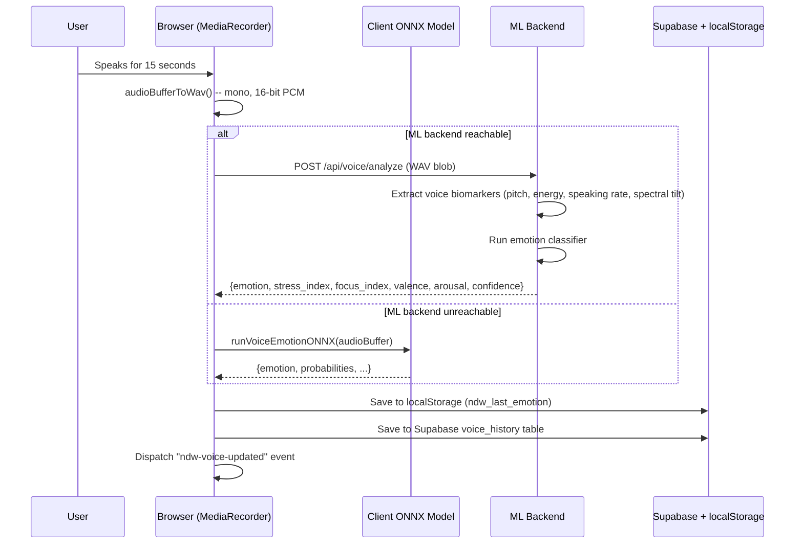
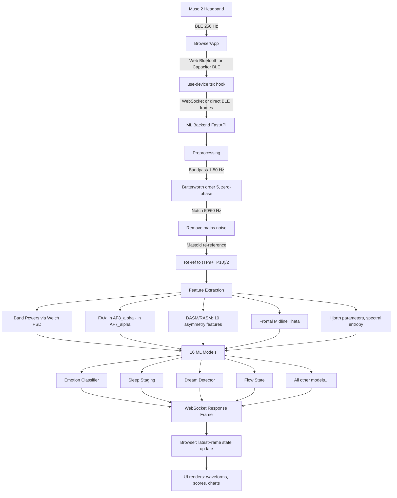
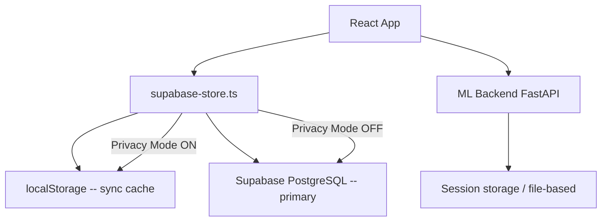
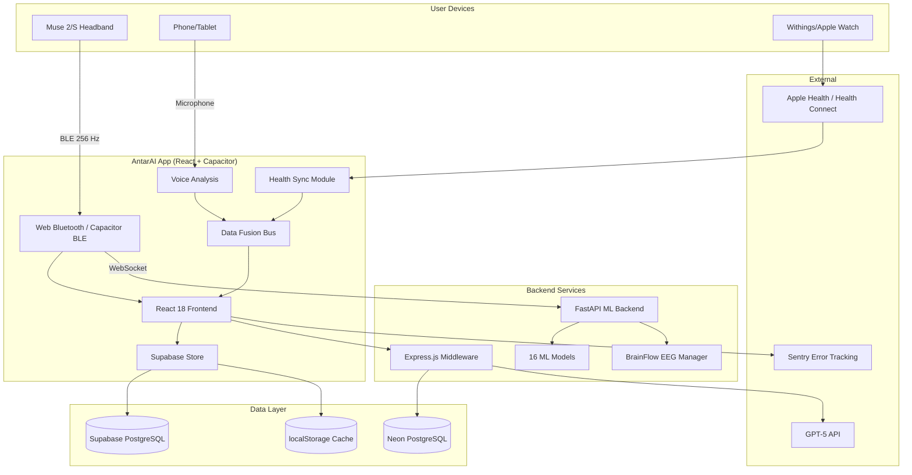

# How AntarAI Works

A comprehensive guide to the AntarAI application -- from what a user sees to what happens under the hood.

*Last updated: 2026-03-23*

---

## 1. What is AntarAI?

AntarAI is a brain-computer interface (BCI) wellness application that fuses three data sources -- EEG brainwaves, voice analysis, and health device metrics -- to give users a real-time, multi-dimensional picture of their emotional and cognitive state. It reads EEG signals from a Muse 2 or Muse S headband, analyzes voice recordings for emotional biomarkers, syncs biometric data from Apple Health or Google Health Connect, and runs 16 machine-learning models to classify emotions, detect dreams, stage sleep, measure focus, estimate creativity, and more. The target audience is anyone interested in understanding their inner state -- from biohackers and meditation practitioners to researchers studying emotion and sleep.

---

## 2. User Journey

### 2.1 Onboarding (5 Steps)

When a user opens AntarAI for the first time, they enter a unified onboarding flow (`/onboarding`) that persists progress to localStorage so it can be resumed if interrupted.

| Step | Screen | What Happens |
|------|--------|-------------|
| 1 | **Welcome** | Brief intro to AntarAI -- what it does, what data it uses |
| 2 | **Choose Path** | User picks "Quick Start (Voice)" or "Full Setup (EEG)" |
| 3a | **Voice Analysis** (Quick Start) | 10-second voice emotion scan -- records audio, sends to ML backend, shows first emotion result |
| 3b | **EEG Calibration** (Full Setup) | 2-minute resting-state EEG baseline recording via Muse headband. Sends frames to `/calibration/baseline/add-frame`. Minimum 30 frames, target 120 frames (2 min at 1 fps) |
| 4 | **Health Sync** | Connect Apple Health (iOS) or Google Health Connect (Android). Skippable. Requests read permissions for HR, HRV, sleep, steps, weight, SpO2, etc. |
| 5 | **Done** | Sets `ndw_onboarding_complete = true` in localStorage, redirects to Today page |

After onboarding, the `ProtectedRoute` wrapper in `App.tsx` checks `ndw_onboarding_complete` before every protected route. If not set, the user is redirected back to `/onboarding`.

### 2.2 First Voice Check-in

The center mic button on the bottom tab bar opens a voice check-in modal. The user speaks for 15 seconds. The audio is:

1. Captured via `MediaRecorder` API
2. Converted to WAV format (mono, 16-bit PCM)
3. Sent to the ML backend (`POST /api/voice/analyze`) or processed client-side via ONNX
4. The result includes: dominant emotion, stress index, focus index, valence, arousal, confidence score
5. Stored in localStorage (`ndw_last_emotion`) and Supabase (`voice_history` table)
6. A `ndw-voice-updated` custom event fires so all pages reactively update

### 2.3 Connecting a Muse Headband

From the Device Setup page (`/device-setup`) or during onboarding:

1. User selects "Muse 2" or "Muse S" from the device list
2. The app attempts **Web Bluetooth** (Chrome desktop) or **Capacitor BLE** (iOS/Android native)
3. On connection success, EEG streaming begins immediately
4. A WebSocket connection opens to the ML backend for real-time analysis
5. If BLE fails on localhost, it falls back to **BrainFlow** via the ML backend
6. EEG data flows at 256 Hz across 4 channels (TP9, AF7, AF8, TP10)

The `useDevice` hook manages the full lifecycle: connecting, streaming, reconnection with exponential backoff (1s, 2s, 4s, 8s, max 5 attempts for BLE), and cleanup.

### 2.4 Connecting Health Data

On native platforms (iOS/Android), the Health page or onboarding triggers:

- **iOS**: `@perfood/capacitor-healthkit` requests read access to 22 data types (heart rate, HRV, sleep stages, steps, SpO2, weight, body fat, VO2 max, blood pressure, ECG, water intake, workouts, etc.)
- **Android**: `@capgo/capacitor-health` requests read access to 12 data types from Google Health Connect

Health data syncs automatically every 15 minutes via the `HealthSyncManager` singleton. Each sync pulls data, saves to localStorage cache, posts to the ML backend (`POST /biometrics/update`), and sends normalized samples to a Supabase Edge Function.

### 2.5 Daily Routine

A typical daily session:

1. **Open app** -- land on Today page, see wellness gauge and last emotion reading
2. **Voice check-in** -- tap the mic button, speak for 15 seconds, see emotion/stress/focus scores
3. **Browse Discover** -- view emotion trends, stress/focus/mood chart, mood insights
4. **Connect Muse** (optional) -- stream EEG for deeper analysis, see real-time brain monitor
5. **Log food** -- enter meals on Nutrition page, see calorie tracking and food quality scores
6. **Review health** -- check synced HR, steps, sleep data on the Health page
7. **Check achievements** -- see badges earned from streaks and milestones

Voice check-in windows: morning (5-12), noon (12-17), evening (17-23). The card auto-hides after a check-in is completed for that window.

---

## 3. The Three Data Sources

### 3.1 Voice Analysis

**What the user does:** Speaks for 10-15 seconds into their phone/computer microphone.

**What happens technically:**



**Voice biomarkers extracted:** Pitch variability, speaking rate, energy envelope, spectral tilt, formant frequencies. These acoustic features correlate with emotional states per Scherer (2003) and Juslin & Laukka (2003).

**Emotion context shown to user:** Each detected emotion comes with a voice pattern description and gentle insight. For example, "happy" shows: "Higher pitch, varied intonation, energetic pace" with the insight "Your voice sounds upbeat. Positive energy tends to show up as wider pitch range and lively rhythm."

### 3.2 EEG (Muse 2 / Muse S)

**Hardware specs:**

| Spec | Value |
|------|-------|
| Channels | 4 EEG (TP9, AF7, AF8, TP10) + Fpz reference |
| Sampling rate | 256 Hz |
| ADC resolution | 12-bit |
| Connection | Bluetooth Low Energy (BLE) |
| Additional sensors | PPG, accelerometer, gyroscope (Muse 2) |

**Full EEG pipeline:**



**Epoch buffering:** Raw EEG arrives at 256 Hz. The ML backend uses a 4-second sliding window (50% overlap, 2-second hop) via `_EpochBuffer`. The response includes `epoch_ready: false` until 4 seconds of data has been buffered. A longer 30-second window is used for stable emotion classification (`emotions.ready` flag).

**Artifact rejection:** Epochs where any channel exceeds 75 uV are flagged as artifact-contaminated. During bad epochs, the EMA (exponential moving average) of previous clean readings is held frozen rather than incorporating noisy data.

**Brain wave bands measured:**

| Band | Frequency | What It Indicates |
|------|-----------|-------------------|
| Delta | 0.5-4 Hz | Deep sleep, unconscious processing |
| Theta | 4-8 Hz | Drowsiness, meditation, creativity |
| Alpha | 8-12 Hz | Relaxation, calm focus |
| Beta | 12-30 Hz | Active thinking, concentration, stress |
| Gamma | 30-100 Hz | Mostly muscle artifact on Muse 2 (not used for emotion) |

**Key signals for emotion:**
- **Frontal Alpha Asymmetry (FAA):** `ln(AF8_alpha) - ln(AF7_alpha)`. Positive = approach motivation (happy). Negative = withdrawal (sad/fearful). The single most validated EEG marker for emotional valence (Davidson, 1992).
- **Beta/alpha ratio:** Higher ratio = more alert/stressed.
- **Theta/beta ratio:** Higher ratio = more drowsy/meditative.
- **High-beta fraction:** `high_beta / total_beta`. Higher = more anxiety.

### 3.3 Health Sync (Apple Health / Google Health Connect)

**Data flow on iOS:**

```mermaid
flowchart LR
    A[Withings Scale/Watch] -->|Bluetooth sync| B[Withings App]
    B -->|HealthKit API| C[Apple Health]
    D[Apple Watch] --> C
    C -->|@perfood/capacitor-healthkit| E[AntarAI App]
    E -->|POST /biometrics/update| F[ML Backend]
    E -->|POST /functions/v1/ingest-health-data| G[Supabase]
    E -->|localStorage cache| H[ndw_health_payload]
```

**Data flow on Android:**

```mermaid
flowchart LR
    A[Withings Scale/Watch] -->|Bluetooth sync| B[Withings App]
    B -->|Health Connect API| C[Google Health Connect]
    C -->|@capgo/capacitor-health| D[AntarAI App]
    D -->|POST /biometrics/update| E[ML Backend]
    D -->|POST /functions/v1/ingest-health-data| F[Supabase]
```

**Data types pulled (comprehensive):**

| Category | Metrics | Source |
|----------|---------|--------|
| Heart | Current HR, resting HR, HRV (SDNN/RMSSD), ECG classification | Watch/wearable |
| Sleep | Total hours, REM hours, deep sleep hours, sleep efficiency | Watch sleep tracking |
| Activity | Steps, active calories, exercise minutes, walking distance, flights climbed, standing hours | Watch/phone sensors |
| Body | Weight (kg), body fat %, lean mass (kg), height, VO2 max, BMI | Smart scale |
| Respiratory | Respiratory rate, SpO2 | Watch |
| Blood | Blood pressure (systolic/diastolic) | Blood pressure monitor |
| Other | Body temperature, water intake | Manual or device entry |
| Workouts | Type, duration, calories burned, average HR per workout | Watch workout tracking |

**How health data influences emotion:** In `data-fusion.ts`, the health source reader (`readHealthSource`) incorporates HR and HRV into stress/arousal:
- HR > 100 bpm: stress bumped up by `min((HR - 100) / 80, 0.3)`
- HRV < 40ms RMSSD: stress bumped up by `min((40 - HRV) / 40, 0.25)`
- HRV > 60ms: stress reduced by `min((HRV - 60) / 80, 0.15)`

---

## 4. Data Fusion

The `DataFusionBus` in `data-fusion.ts` is a singleton event bus that merges all three sources into a unified `FusedState`.

### 4.1 Source Weights

| Source | Weight | Rationale |
|--------|--------|-----------|
| EEG | 0.50 | Real-time physiological signal, highest temporal resolution |
| Voice | 0.35 | Direct emotional expression via acoustic features |
| Health | 0.15 | Background physiological context (HR, HRV, sleep) |

### 4.2 Fusion Algorithm

```
For each available source:
    base_weight = SOURCE_WEIGHTS[source]           # 0.50, 0.35, or 0.15
    freshness = 1.0 if age < 5 min, else 0.5      # stale discount
    effective_weight = base_weight * confidence * freshness

    fusedStress  += source.stress * effective_weight
    fusedFocus   += source.focus * effective_weight
    fusedValence += source.valence * effective_weight
    fusedArousal += source.arousal * effective_weight
    totalWeight  += effective_weight

Final values = weighted sums / totalWeight
Dominant emotion = from the source with the highest effective weight
```

### 4.3 Post-Fusion Adjustments

**Circadian normalization** (`circadian-adjustment.ts`): Adjusts readings based on time of day to account for natural physiological rhythms.

| Time Window | Stress Offset | Focus Offset | Alpha Offset | Why |
|-------------|---------------|--------------|--------------|-----|
| 0-5 AM (sleep) | -0.05 | -0.15 | +0.10 | Deep sleep zone |
| 6-9 AM (cortisol surge) | +0.15 | +0.05 | -0.05 | Morning cortisol naturally elevates stress |
| 9 AM-12 PM (optimal) | 0 | 0 | 0 | Peak cognitive window |
| 1-3 PM (post-lunch dip) | -0.05 | -0.12 | +0.08 | Focus naturally lower |
| 8-11 PM (wind-down) | -0.08 | -0.08 | +0.12 | Melatonin rising, alpha increases |

**Cycle phase adjustment** (`cycle-phase-adjustment.ts`): If menstrual cycle data is present, shifts baselines by hormonal phase:

| Phase | Mood Offset | Energy Offset | Irritability Offset |
|-------|-------------|---------------|---------------------|
| Menstrual (days 1-5) | -0.05 | -0.12 | +0.05 |
| Follicular (days 6-13) | +0.10 | +0.08 | -0.05 |
| Ovulatory (days 14-15) | +0.15 | +0.12 | -0.08 |
| Luteal (days 16-28) | -0.10 | -0.08 | +0.12 |

### 4.4 Event System

The bus listens for update events from all sources:

- `ndw-eeg-updated` -- new EEG frame processed
- `ndw-voice-updated` -- new voice analysis completed
- `ndw-emotion-update` -- any emotion source updated
- `ndw-health-updated` -- health sync completed
- `storage` -- localStorage changes (cross-tab)

On any event, the bus reads all three sources from localStorage, runs the fusion algorithm, applies circadian normalization, and notifies all subscribers (React hooks via `useFusedState`).

---

## 5. The 16 ML Models

All models live in `ml/models/` and are loaded on ML backend startup. The loading chain: ONNX (fastest) -> pkl/joblib (scikit-learn/LightGBM) -> PyTorch (.pt) -> feature-based heuristics (no saved model needed).

### 5.1 Emotion Classifier

**File:** `ml/models/emotion_classifier.py`
**Measures:** 6 emotions (happy, sad, angry, fearful, relaxed, focused) + valence (-1 to +1) + arousal (0 to 1) + stress/focus/relaxation indices
**EEG features used:** FAA, alpha/beta ratio, theta/beta ratio, high-beta fraction, DASM/RASM (10 asymmetry features), frontal midline theta, band powers across all 4 channels
**Model priority chain:**
1. EEGNet 4-channel (85.00% CV) -- active live path for 4-channel input
2. Mega LGBM (71.52% CV) -- 11 datasets, 187K samples
3. Muse-native LGBM (69.25% CV) -- no PCA, Muse-native features
4. TSception (~69% CV) -- requires >= 4 sec epoch
5. Feature-based heuristics -- always available fallback

**What the user sees:** Dominant emotion label, stress/focus/mood percentages, confidence score, emotion probabilities chart

**Output structure:**
```json
{
  "emotion": "happy",
  "probabilities": {"happy": 0.45, "sad": 0.05, "angry": 0.03, "fear": 0.02, "surprise": 0.15, "neutral": 0.30},
  "valence": 0.35,
  "arousal": 0.55,
  "stress_index": 0.25,
  "focus_index": 0.72,
  "relaxation_index": 0.68,
  "frontal_asymmetry": 0.12,
  "model_type": "eegnet_4ch"
}
```

### 5.2 Sleep Staging

**File:** `ml/models/sleep_staging.py`
**Measures:** 5 sleep stages (Wake, N1, N2, N3/Deep, REM)
**Key features:** Delta dominance (N3), theta oscillations (REM), alpha spindles (N1/N2), spindle detection, K-complex detection, Markov state transitions
**Accuracy:** 92.98% (ISRUC dataset)
**What the user sees:** Current sleep stage with transition probability, sleep stage timeline

### 5.3 Dream Detector

**File:** `ml/models/dream_detector.py`
**Measures:** Binary dreaming/not-dreaming classification
**Key features:** REM sleep presence + theta oscillations + rapid eye movement artifacts via EOG-like signals
**Accuracy:** 97.20% (synthetic data) -- expected 82-88% cross-subject on real data
**What the user sees:** Dream probability indicator, dream intensity score, lucidity estimate

### 5.4 Flow State Detector

**File:** `ml/models/flow_state_detector.py`
**Measures:** "In the zone" score (0-1)
**Key features:** Alpha/theta coherence, moderate beta (not anxious), theta-gamma coupling
**Accuracy:** ~72-75% binary mode (default), 62.86% 4-class
**What the user sees:** Flow score, "in flow" boolean indicator, confidence

### 5.5 Creativity Detector

**File:** `ml/models/creativity_detector.py`
**Measures:** Creative thinking patterns (alpha/theta increases during divergent thinking)
**Key features:** Theta power (incubation phase), alpha power (insight phase)
**Accuracy:** Experimental (overfit artifact -- real cross-subject ~60%)
**What the user sees:** Creativity score with `experimental: true` flag and confidence note

### 5.6 Drowsiness Detector

**File:** `ml/models/drowsiness_detector.py`
**Measures:** Sleepiness level
**Key features:** Theta power increase, alpha slowing, slow eye movements
**What the user sees:** Alert/drowsy/sleepy state, drowsiness index

### 5.7 Cognitive Load Estimator

**File:** `ml/models/cognitive_load_estimator.py`
**Measures:** Mental workload (low/medium/high)
**Key features:** Frontal theta increase (working memory load), theta-gamma coupling
**What the user sees:** Cognitive load level with load index

### 5.8 Attention Classifier

**File:** `ml/models/attention_classifier.py`
**Measures:** Attention level
**Key features:** Beta/theta ratio (focused attention), alpha suppression (task engagement)
**What the user sees:** Attention state (focused/distracted), attention score

### 5.9 Stress Detector

**File:** `ml/models/stress_detector.py`
**Measures:** 4 stress levels (relaxed/mild/moderate/high)
**Key features:** High-beta (20-30 Hz), right > left frontal alpha (Davidson asymmetry)
**What the user sees:** Stress level label, stress index, confidence

### 5.10 Lucid Dream Detector

**File:** `ml/models/lucid_dream_detector.py`
**Measures:** Lucid dream state during REM
**Key features:** 40 Hz gamma bursts during REM sleep (Voss et al., 2009)
**What the user sees:** Lucidity score, state label

### 5.11 Meditation Classifier

**File:** `ml/models/meditation_classifier.py`
**Measures:** 5 meditation depths (surface/light/moderate/deep/transcendent)
**Key features:** Theta dominance (deep), gamma bursts + theta-gamma coupling (transcendent)
**What the user sees:** Meditation depth label, meditation score

### 5.12 Anomaly Detector

**File:** `ml/models/anomaly_detector.py`
**Measures:** Statistically unusual EEG patterns (Isolation Forest)
**Use:** Artifact flagging, unusual brain state detection, hardware disconnection detection

### 5.13 Artifact Classifier

**File:** `ml/models/artifact_classifier.py`
**Measures:** Artifact type (eye blink, muscle, electrode pop)
**Use:** Data quality scoring, epoch rejection decisions

### 5.14 Denoising Autoencoder

**File:** `ml/models/denoising_autoencoder.py`
**Measures:** Clean signal reconstruction from noisy input (PyTorch autoencoder)
**Use:** Improves signal quality before classification

### 5.15 Memory Encoding Predictor

**File:** `ml/models/creativity_detector.py` (shared file)
**Measures:** How effectively a memory is being encoded
**Key features:** Theta oscillations during encoding, gamma-theta coupling

### 5.16 Online Learner

**File:** `ml/models/online_learner.py`
**Measures:** Adapts model weights to individual user over time
**Status:** Partially integrated -- not yet in the live inference path

---

## 6. Page-by-Page Walkthrough

### 6.1 Today (`/` -- `today.tsx`)

The main landing page after login.

**What the user sees:**
- **Wellness Gauge:** A 270-degree arc gauge (0-100) computed from: `(1 - stress) * 30 + focus * 30 + ((valence + 1) / 2) * 20 + 20`
- **Score Cards:** Three cards showing Mood (valence mapped to Positive/Normal/Low), Stress (Low/Moderate/High), and Focus (Sharp/Moderate/Diffuse) with trend deltas vs. previous session
- **AI Insight:** Context-aware text recommendation based on current stress/focus/valence
- **Weather Context:** Current weather conditions and how they might affect mood
- **Cycle Phase Context:** If cycle data exists, shows current menstrual phase and its emotional impact
- **Quick Actions:** Log food, share wellness score, start breathing exercise
- **Recent Mood Logs:** Last few manually logged moods with energy levels
- **Inline Breathe:** Animated breathing exercise widget
- **Confidence Meter:** Shows the reliability of the current reading based on data recency and source availability

**Data sources:** `useFusedState()` hook (fused EEG + voice + health), `useHealthSync()` for health metrics, `useVoiceData()` for voice check-in results, weather API, cycle data from Supabase.

**Actions available:** Voice check-in (mic button), log mood manually, share wellness score as image, navigate to detailed views.

### 6.2 Discover (`/discover` -- `discover.tsx`)

Scores at a glance and feature discovery.

**What the user sees:**
- **Emotions Overview Chart:** Recharts area chart showing stress (pink), focus (indigo), mood (teal) as continuous trend lines over 7 days. Each data point is an individual reading (not daily averages).
- **Emotion Timeline:** Color-coded dots for last 7 days showing dominant emotion per day
- **Mood Insights:** Pattern detection cards (e.g., "Mostly happy this week", stress trends, time-of-day patterns)
- **Recommended for You:** Up to 3 personalized suggestions based on current emotion (e.g., "Breathing Exercise" when stress is high, "Neurofeedback" when focus is low)
- **Explore Grid:** 2-column navigation to Sleep, Brain, Health, Inner Energy, Wellness, Couples Meditation

**Data sources:** API history (`/api/brain/history/{userId}?days=7`), local emotion history, session summaries, food logs, fused state.

### 6.3 Brain Monitor (`/brain-monitor` -- `brain-tabs.tsx`)

Consolidated brain page with three tabs.

**What the user sees:**
- **Brain Age Card:** Estimated brain age vs. actual age with gap indicator
- **Live EEG Tab:** Real-time waveform display for all 4 channels (TP9, AF7, AF8, TP10), band power bars (delta through gamma), all 16 model scores updating in real-time
- **Neurofeedback Tab:** Guided neurofeedback training with cognitive reappraisal prompts. User follows breathing/focus protocols while EEG provides real-time feedback.
- **Connectivity Tab:** Brain region connectivity analysis showing inter-channel coherence and phase locking values

**Data sources:** `useDevice()` hook provides `latestFrame` with full analysis from all 16 models, signal quality metrics, and raw waveform data.

### 6.4 Health (`/health` -- `health.tsx`)

Health sync status and body metrics.

**What the user sees:**
- Sync status (last sync time, data availability)
- Current heart rate, resting heart rate
- Steps today with progress toward 10,000 goal
- Sleep summary (total hours, efficiency)
- Body metrics tabs (weight trend, body fat, BMI)
- Workout history from HealthKit/Health Connect

**Data sources:** `useHealthSync()` hook, which pulls from `HealthSyncManager` singleton.

### 6.5 Nutrition (`/nutrition` -- `nutrition.tsx`)

Food logging and nutritional tracking.

**What the user sees:**
- Food entry form with auto meal type detection (breakfast before noon, lunch before 5, dinner after)
- Barcode scanner integration (`lookupBarcode`)
- Today's calorie total and macro breakdown
- Food quality score per meal
- Vitamin/mineral tracking (D, B12, C, iron, magnesium, zinc, omega-3)
- Meal-cognitive correlation: how food affects focus/mood in the hours after eating
- GLP-1 injection tracker
- Favorite meals for quick re-logging

**Data sources:** Food logs from Supabase/localStorage, emotion history for meal-cognitive correlations, barcode API.

### 6.6 Wellness (`/wellness` -- `wellness.tsx`)

Mood logging and menstrual cycle tracking.

**What the user sees:**
- **Mood Logger:** 1-10 mood scale with energy level, free-text notes. Synced to ML backend.
- **Mood History:** Area chart of mood and energy over time
- **Menstrual Cycle Calendar:** Visual calendar with flow level logging (none/light/medium/heavy)
- **Symptom Tracker:** 20 symptoms (cramps, bloating, headache, mood swings, fatigue, etc.) with severity levels
- **Hormone Phase Info:** Current phase with hormonal context (e.g., "Follicular: Estrogen rising")
- **Cycle Settings:** Configure cycle length, period length, last period start date

**Data sources:** `saveMoodLog()` / `getMoodLogs()` and `saveCycleData()` / `getCycleData()` from supabase-store.

### 6.7 AI Chat (`/ai-companion` -- `ai-companion.tsx`)

AI wellness companion.

**What the user sees:** Chat interface powered by GPT-5 (via Express middleware). The AI has context about the user's current emotional state, recent check-ins, and health data.

### 6.8 You (`/you` -- `you.tsx`)

User profile and settings hub.

**What the user sees:**
- Profile info with member-since date
- Current streak count and longest streak
- Total sessions count
- Chronotype quiz result (if taken)
- Connected devices status (Health Connect, Muse, Oura, WHOOP, Garmin)
- Personalization stats (correction count, modality accuracies)
- Navigation to: Achievements, Connected Assets, Settings, Notifications, Consent Settings, Export, Help
- Theme toggle (light/dark)

### 6.9 Additional Pages (Selected)

| Page | Route | Key Features |
|------|-------|-------------|
| **Achievements** | `/achievements` | Bronze/silver/gold badges across 5 categories (Sessions, Streaks, Milestones, Wellness, Brain). Computed from localStorage data, not server-side. |
| **Sleep** | `/sleep` | Sleep tracking with CBTI module, sleep stories/music, sleep session recording |
| **Deep Work** | `/deep-work` | Pomodoro timer with EEG-enhanced focus tracking |
| **Dream Journal** | `/dreams` | Record dreams with AI-powered analysis (GPT-5) |
| **Biofeedback** | `/biofeedback` | Guided meditation, flow training, creativity sessions with EEG feedback |
| **Pain Tracker** | `/pain-tracker` | Pain/migraine logging correlated with EEG theta tracking |
| **Community** | `/community` | Anonymous mood sharing, daily challenges, streaks leaderboard |
| **Couples Meditation** | `/couples-meditation` | Dual-device meditation session measuring brain synchrony |
| **Research Hub** | `/research` | Study participation with morning/daytime/evening research sessions |

---

## 7. Data Storage

### 7.1 Architecture



The `supabase-store.ts` module implements a dual-write pattern:

1. **On save:** Write to both localStorage (sync, immediate) AND Supabase (async, fire-and-forget)
2. **On read:** Try Supabase first. If it fails (offline, no auth), fall back to localStorage
3. **On first connect:** One-time migration of all localStorage data to Supabase (`syncLocalToSupabase`)
4. **Privacy Mode:** When `ndw_privacy_mode = "true"`, ALL Supabase sync is disabled. Data stays local only.

### 7.2 Supabase Tables

| Table | Contents | Key Fields |
|-------|----------|------------|
| `mood_logs` | Manual mood ratings | user_id, mood (1-10), energy, notes, created_at |
| `voice_history` | Voice analysis results | user_id, emotion, stress, focus, valence, arousal, created_at |
| `emotion_history` | Fused emotion timeline | user_id, stress, focus, mood, source, created_at |
| `food_logs` | Meal entries | user_id, summary, calories, protein, carbs, fat, food_quality_score |
| `cycle_data` | Menstrual cycle config | user_id, last_period_start, cycle_length, period_length, logged_days |
| `brain_age` | Brain age estimates | user_id, estimated_age, actual_age, gap |
| `glp1_injections` | GLP-1 medication tracking | user_id, medication, dose, injected_at |
| `notifications` | In-app notifications | user_id, type, title, body, read |
| `user_settings` | Key-value settings | user_id, key, value |
| `generic_store` | JSON blob storage | user_id, key, value (JSON) |
| `health_samples` | Normalized health data (via Edge Function) | source, metric, value, unit, recorded_at |
| `body_metrics` | Weight/body composition history | user_id, weight_kg, body_fat_pct, height_cm, source |

### 7.3 localStorage Keys (Key Ones)

| Key | What It Stores |
|-----|---------------|
| `ndw_last_emotion` | Latest voice/fused emotion result |
| `ndw_last_eeg_emotion` | Latest EEG-specific emotion result |
| `ndw_health_emotion` | Latest health-derived emotion estimates |
| `ndw_emotion_history` | Array of last 200 emotion readings (7-day window) |
| `ndw_health_payload` | Cached health sync data |
| `ndw_onboarding_complete` | Boolean: onboarding finished |
| `ndw_privacy_mode` | Boolean: disable all cloud sync |
| `ndw_streak_count` / `ndw_streak_last_date` | Check-in streak tracking |
| `ndw_feature_usage` | Set of routes visited (for progressive discovery) |
| `ndw_brain_age` | Latest brain age estimate |
| `ml_backend_url` | Override URL for ML backend |

---

## 8. Security and Privacy

### 8.1 Consent System

The Consent Settings page (`/consent-settings`) provides per-modality biometric consent toggles. Users can individually enable/disable:
- EEG data collection
- Voice analysis
- Health data sync
- Location data

### 8.2 Privacy Mode

When enabled (`ndw_privacy_mode = "true"`), the `getSupabaseIfAllowed()` gate in `supabase-store.ts` returns `null`, blocking ALL Supabase calls. Data exists only in browser localStorage. Nothing leaves the device.

### 8.3 Authentication

- **Supabase Auth:** Email/password + OAuth. The `useAuth` hook wraps Supabase's auth client.
- **ProtectedRoute wrapper:** All non-public routes require authentication. Unauthenticated users are redirected to `/auth`.
- **ML Backend API Key:** The FastAPI backend uses `APIKeyMiddleware` for request authentication.

### 8.4 Row-Level Security (RLS)

Supabase tables use RLS policies so users can only read/write their own data. The `user_id` column in every table is matched against the authenticated user's JWT.

### 8.5 Rate Limiting

The ML backend enforces 100 requests per minute per IP address. Health checks and docs are exempt.

### 8.6 Regulatory Compliance

- **Privacy Policy** (`/privacy`): Public page (no auth required) with full EU AI Act notice
- **HIPAA Notifications:** Health data handling follows HIPAA notification patterns
- **EU AI Act:** The app discloses AI involvement in emotion classification and provides transparency about model accuracy and limitations
- **Data Export** (`/export`): Users can export all their data in downloadable format

### 8.7 Error Monitoring

Sentry is integrated via `@sentry/react`. The `SentryErrorBoundary` wraps all routes and reports crashes with a branded fallback UI.

---

## 9. Offline Support

### 9.1 Dual-Write Pattern

Every data write goes to localStorage (synchronous, instant) AND Supabase (asynchronous, best-effort). This means the app is fully functional offline -- localStorage serves as the cache layer.

### 9.2 Data Freshness on Reconnect

When the app regains connectivity:
- TanStack Query refetches stale queries automatically based on configured `staleTime` values
- The one-time `syncLocalToSupabase()` migration runs on first Supabase connection (flagged by `ndw_supabase_synced`)
- Health sync resumes on its 15-minute interval

### 9.3 WebSocket Resilience

The EEG WebSocket in `use-device.tsx` implements:
- **Auto-reconnect** with exponential backoff (1s, 2s, 4s, 8s cap)
- **Stale frame detection:** If no frame arrives for 15 seconds on an "open" WebSocket, it reconnects
- **Visibility change handler:** When the tab becomes visible again, immediately reconnects if WebSocket died in the background
- **Remote backend limit:** On production (non-localhost), max 2 reconnect attempts then stop (no local hardware)
- **BLE reconnect:** Separate exponential backoff for Bluetooth (1s, 2s, 4s, 8s, 16s, max 5 attempts)

### 9.4 Synthetic EEG Mode

When the ML backend is unreachable and the user selects "Synthetic (Demo)," the app generates client-side synthetic EEG frames (`generateSyntheticFrame()`) with plausible waveforms and model outputs. This allows full UI exploration without hardware.

---

## 10. Building and Deploying

### 10.1 Local Development

```bash
# Frontend + Express middleware (port 4000)
cd /Users/sravyalu/NeuralDreamWorkshop
npm install
npm run dev

# ML backend (port 8080) -- separate terminal
cd ml
./start.sh
# start.sh: activates venv, installs deps, starts uvicorn on port 8080,
# optionally starts ngrok tunnel for remote access
```

**Port assignments:**
- Frontend/Express: port 4000 (Datadog occupies 5000, Grafana occupies 3000)
- ML backend: port 8080

### 10.2 Building APK (Android)

```bash
# Build the web assets
npm run build

# Sync to Capacitor
npx cap sync android

# Open in Android Studio
npx cap open android

# Build APK from Android Studio: Build -> Build Bundle / APK -> Build APK
```

### 10.3 Deploying Frontend to Vercel

The frontend auto-deploys on push to `main` via Vercel's GitHub integration. Manual deploy:

```bash
vercel --prod
```

**Key Vercel config:**
- `VITE_ML_API_URL` environment variable must point to the ML backend (Railway service URL for production)
- Crons must be `@daily` or less frequent (Hobby plan limitation)

### 10.4 Deploying ML Backend to Railway

```bash
npm install -g @railway/cli
railway login
railway link        # select the Railway project
railway up          # deploys ml/ via ml/Dockerfile
```

After deploy: copy the Railway service URL, set it as `VITE_ML_API_URL` in Vercel dashboard, redeploy frontend.

### 10.5 Database Migrations

```bash
# Using Drizzle ORM
npx drizzle-kit push
```

Schema is defined in `shared/schema.ts` and shared between client and server.

---

## Appendix A: Architecture Diagram



## Appendix B: Full Route Table

The app has **72 active pages**, **5 hidden/redirected routes**, and **3 route aliases** for a total of **80 routes** in `App.tsx`.

**Bottom tab pages (always loaded):** Today (`/`), Discover (`/discover`), Nutrition (`/nutrition`), AI Chat (`/ai-companion`), You (`/you`)

**Lazy-loaded pages:** All other pages are code-split via `React.lazy()` for faster initial load. A branded `PageLoader` splash screen shows while chunks download.

**Public routes (no auth):** Welcome, Auth, Forgot/Reset Password, Onboarding, Privacy Policy, Architecture Guide, Study pages

**Protected routes:** Everything else -- wrapped in `ProtectedRoute` which checks onboarding completion and auth status.

See `docs/APP_PAGES.md` for the complete page listing with routes, files, and descriptions.

## Appendix C: WebSocket Frame Structure

Each WebSocket frame from the ML backend during EEG streaming contains:

```typescript
{
  signals: number[][],           // Raw EEG: 4 channels x N samples
  analysis: {
    band_powers: Record<string, number>,  // delta, theta, alpha, beta, gamma
    features: Record<string, number>,
    emotions: {                   // From emotion_classifier.py
      emotion: string | null,
      confidence: number,
      valence: number,            // -1 to 1
      arousal: number,            // 0 to 1
      stress_index: number,
      focus_index: number,
      relaxation_index: number,
      probabilities: Record<string, number>,
      ready: boolean,             // true after 30s window filled
      buffered_sec: number,
    },
    sleep_staging: { stage, confidence, probabilities },
    dream_detection: { is_dreaming, probability, rem_likelihood, dream_intensity, lucidity_estimate },
    flow_state: { in_flow, flow_score, confidence },
    creativity: { creativity_score, state, confidence },
    drowsiness: { state, drowsiness_index, confidence },
    cognitive_load: { level, load_index, confidence },
    attention: { state, attention_score, confidence },
    stress: { level, stress_index, confidence },
    lucid_dream: { state, lucidity_score, confidence },
    meditation: { depth, meditation_score, confidence },
    memory_encoding: { encoding_active, encoding_score, state, confidence },
    epoch_ready: boolean,         // true when >= 4s buffered
  },
  quality: {
    sqi: number,                  // Signal Quality Index 0-100
    artifacts_detected: string[],
    clean_ratio: number,
    channel_quality: number[],
  },
  signal_quality_score: number,   // 0-100
  artifact_detected: boolean,
  artifact_type: "clean" | "blink" | "muscle" | "electrode_pop",
  emotion_shift: {                // Detected when emotion changes significantly
    shift_detected: boolean,
    previous_emotion: string,
    current_emotion: string,
    magnitude: number,
    guidance: string,
  },
  timestamp: number,
  n_channels: number,             // 4
  sample_rate: number,            // 256
}
```
