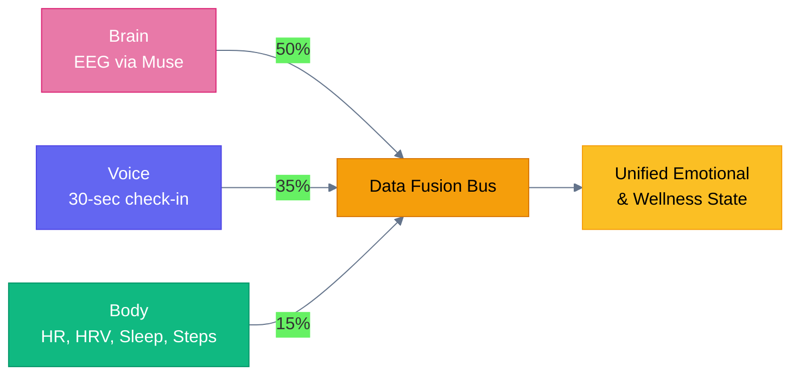
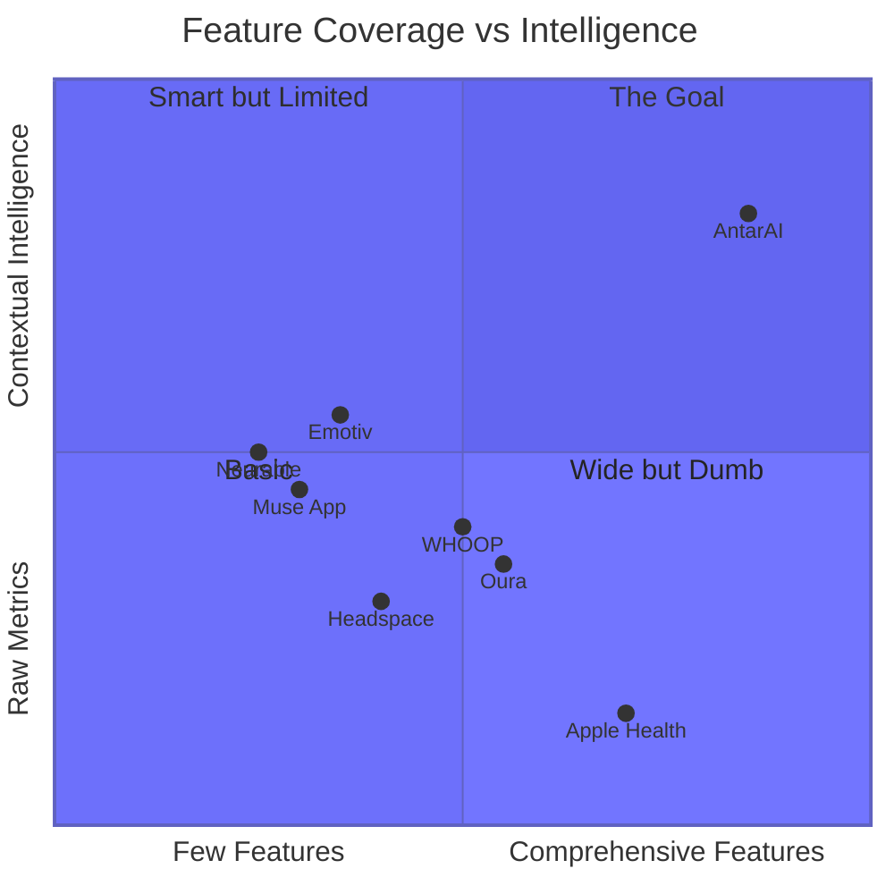

# Why AntarAI? — What Makes It Different

## The Problem No One Has Solved

Every health app today gives you **one piece of the puzzle**:

- **Headspace/Calm** — guided meditation, no biometrics
- **Oura/WHOOP** — body metrics (HR, HRV, sleep), no brain data, no emotions
- **Muse app** — EEG meditation feedback, but ONLY meditation (no emotions, no health, no nutrition)
- **Emotiv** — research-grade EEG, but no consumer wellness features
- **Apple Health / Google Fit** — data aggregator, no intelligence

**None of them fuse brain + body + voice into one unified picture.**

---

## What Makes AntarAI Unique

### 1. Three-Source Multimodal Fusion (No One Else Does This)

| Feature | Muse App | Oura | WHOOP | Headspace | AntarAI |
|---------|---------|------|-------|-----------|---------|
| EEG brain data | Meditation only | No | No | No | **16 ML models, real-time** |
| Voice emotion analysis | No | No | No | No | **Yes, 30-sec check-in** |
| Heart rate / HRV | No | Yes | Yes | No | **Yes, via Health Connect** |
| Sleep staging | Basic | Yes | Yes | No | **EEG-grade (92.98%)** |
| Emotion detection | No | No | No | No | **6 emotions + valence/arousal** |
| Stress tracking | Meditation only | Stress score | Stress score | No | **Real-time from brain + voice + body** |
| Focus tracking | No | No | No | Focus music | **Real-time from EEG** |
| Dream detection | No | No | No | No | **REM + theta analysis** |
| Lucid dream detection | No | No | No | No | **Gamma bursts in REM** |
| Brain age | No | No | No | No | **Alpha peak regression** |
| Flow state | No | No | No | No | **EEG flow detection** |
| Neurofeedback training | Basic | No | No | No | **Full protocol with reappraisal** |
| Nutrition tracking | No | No | No | No | **Food logging + GLP-1 tracker** |
| Menstrual cycle + EEG | No | Cycle tracking | No | No | **Cycle phase adjusts EEG baselines** |
| Multimodal data fusion | No | No | No | No | **Weighted fusion of all 3 sources** |

### 2. Brain + Body Intelligence (Not Just Metrics)

**Oura/WHOOP** tell you your HRV is 45ms. So what?

**AntarAI** tells you:
- Your stress is elevated (brain EEG confirms it, not just heart rate)
- It's likely because you're in the luteal phase of your cycle (mood baseline is naturally lower)
- Your post-lunch focus typically dips at this time (circadian adjustment)
- Here's a 2-minute breathing exercise that works for your pattern

The difference: **context-aware, multimodal intelligence** vs raw numbers.

### 3. Works Without the Headband

Most EEG apps are useless without the device. AntarAI works with **any combination**:

| Connected Sources | What You Get |
|---|---|
| Voice only | Emotion, stress, focus from voice biomarkers |
| Voice + Health | Above + HR/HRV/sleep context, trend charts |
| EEG only | Real-time brain state, 16 ML models, brain age |
| EEG + Voice | Full multimodal fusion, highest accuracy |
| EEG + Voice + Health | Complete picture — brain + voice + body fused |
| Health only | Body metrics with wellness scoring |

**The headband enhances, it doesn't gate.** A 30-second voice check-in is always available.

### 4. 16 ML Models Running Simultaneously

No other consumer app runs this many brain analysis models:

| Category | Models | What They Do |
|----------|--------|-------------|
| **Emotion** | Emotion Classifier (85% CV) | 6 emotions + valence + arousal |
| **Sleep** | Sleep Staging, Dream Detector, Lucid Dream, Drowsiness | Full sleep lab in your headband |
| **Cognition** | Focus, Attention, Cognitive Load, Flow, Creativity | Know your brain state, not just "calm" |
| **Wellness** | Stress, Meditation, Brain Age | Long-term brain health tracking |
| **Signal** | Artifact, Anomaly, Denoising, Online Learner | Self-improving signal quality |

Muse app: 1 model (calm/active). AntarAI: 16 models.

### 5. Honest Accuracy (No Fake Numbers)

Every competitor hides their accuracy. We show it:

- Emotion: **85% CV** (EEGNet) — but we tell you it's **55-65% for specific emotions** in real-world
- Sleep staging: **92.98%** — comparable to clinical PSG
- Flow: **62.86%** — we say "experimental" right in the UI
- Creativity: **99.18%** — but we label it **"OVERFIT, ~60% real"** with a warning badge

Every reading shows a **confidence meter** (green/amber/red). When it's low, we say "Not enough data" instead of guessing.

**Trust is built by admitting uncertainty, not hiding it.**

### 6. Your Data, Your Control

| Feature | Muse App | Oura | AntarAI |
|---------|---------|------|---------|
| Per-modality consent | No | No | **Yes — toggle EEG, voice, health independently** |
| Privacy mode (all local) | No | No | **Yes — zero cloud sync** |
| Data export | Limited | Limited | **Full CSV/JSON export** |
| See what AI knows | No | No | **Confidence meter on every reading** |
| EU AI Act compliant | Unknown | Unknown | **Yes — documented in privacy policy** |
| HIPAA-safe notifications | Unknown | Unknown | **Yes — no health data on lock screen** |

### 7. Circadian + Hormonal Intelligence

AntarAI adjusts every reading based on:

- **Time of day**: Morning cortisol surge (6-9am) means stress baseline is naturally higher — we don't flag it as "high stress"
- **Chronotype**: Night owls have different alpha patterns than early birds
- **Menstrual cycle phase**: Luteal phase naturally lowers mood baseline — we show "Luteal phase — mood may be lower than usual" instead of alarming you
- **Age group**: Children, teens, adults, seniors have different brain baselines

**No other app does this.** Oura shows you a "readiness score" without context. We show you *why* and *what to do about it*.

### 8. Self-Improving System

AntarAI learns from you:

- **Emotion correction**: Disagree with the detected emotion? Tap to correct it. After 5 corrections, the model retrains
- **Baseline calibration**: 2-minute resting state calibration improves accuracy by 15-29%
- **Online learning**: Per-user model adaptation over time (SGD on your data)
- **Adaptive sampling**: Reduces processing when you're still, ramps up during activity

### 9. Not Just Tracking — Intervention

Research shows mood tracking alone can make people **worse** (JMIR 2026 meta-analysis). AntarAI always pairs data with action:

- Stressed? → "Try a 2-minute breathing exercise" (link to biofeedback)
- Sad? → "Talk to your AI companion" (link to chat)
- EMG noise? → "Signal too noisy — try relaxing your forehead" (not a fake reading)
- High stress during neurofeedback? → Cognitive reappraisal prompt with science-backed technique

### 10. Open Science, Not a Black Box

CLAUDE.md contains **40KB of EEG science documentation**: every formula, every bug fix, every accuracy number. The full signal processing pipeline is documented with citations to peer-reviewed papers.

Compare that to Muse app's "calm score" with zero documentation on how it's calculated.

---

## Competitive Landscape

---

## The Moat

1. **Multimodal data flywheel**: More data sources → better fusion → more accurate insights → more user trust → more data
2. **16 ML models**: No competitor has this breadth on consumer EEG
3. **Honest accuracy culture**: Users trust us because we show confidence, not fake certainty
4. **EEG + wearable fusion**: First to combine brain data with Withings/Oura/WHOOP/Garmin
5. **Cycle-aware + circadian-aware**: First to adjust brain readings for hormonal and time-of-day context
6. **Open science foundation**: 40KB of documented neuroscience — can't be replicated by marketing alone

---

## In One Sentence

> **AntarAI is the only app that reads your brain, listens to your voice, and connects your body data — then fuses all three into one honest, context-aware picture of how you actually feel.**

---

*Sources:*
- [Meditation Apps in 2026](https://editorialge.com/meditation-apps-in-2026/)
- [Best Home EEG Devices 2026 — Emotiv](https://www.emotiv.com/blogs/news/best-home-eeg-device)
- [Top Neurofeedback Devices 2026 — Myndlift](https://www.myndlift.com/post/2026-guide-top-8-neurofeedback-devices-for-brain-training)
- [Best Wellness Apps 2026](https://pausaapp.com/en/blog/top-10-apps-for-wellness-in-2026-picked-for-real-life-not-hype)
